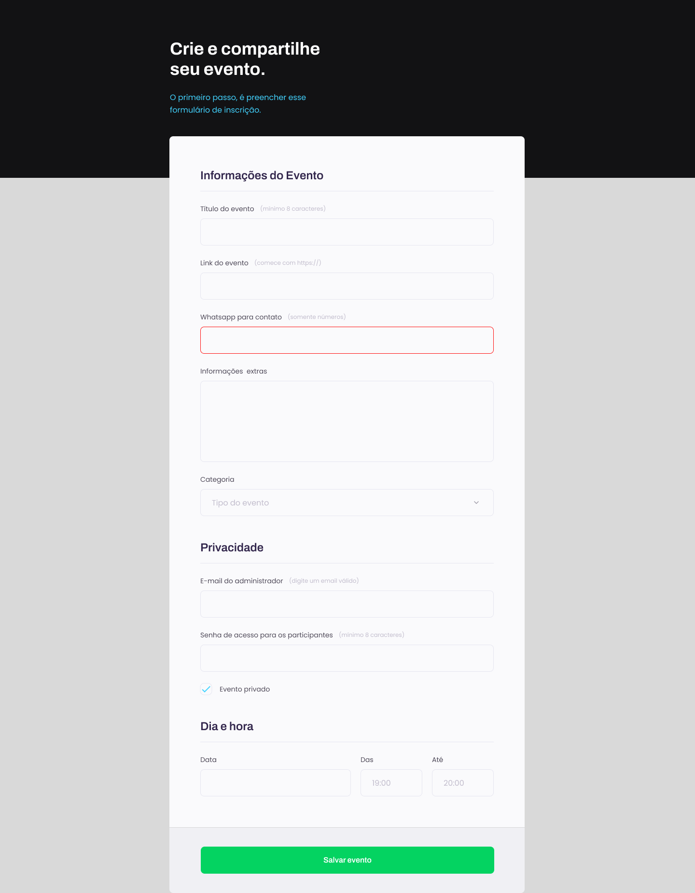

<h1 align="center"> Event form </h1>

This is a project from the Explorer course by Rocketseat.

  <a href="#-technologies">Technologies</a>&nbsp;&nbsp;&nbsp;|&nbsp;&nbsp;&nbsp;
  <a href="#-project">Project</a>&nbsp;&nbsp;&nbsp;|&nbsp;&nbsp;&nbsp;
  <a href="#-layout">Layout</a>&nbsp;&nbsp;&nbsp;|&nbsp;&nbsp;&nbsp;
  <a href="#memo-license">License</a>

  

 

  

## 🚀 Technologies

This project was developed with the following technologies:

- HTML e CSS
- Git e Github

## 💻 Project

The event form is a project which creates an event form that needs to be filled up.

## 🔖 Layout

You can view the layout of the project through [THIS LINK](https://www.figma.com/file/Up0b7csHk6F1Vn4a7XkxJD/Explorer-Stage-03-Projeto-01-(Copy)?node-id=1%3A28&t=KwLscGtujRxOFVI8-0). It is necessary to have an account on [Figma](https://figma.com) to access it.

## :memo: License

This project is licensed under MIT.

---

Made with ♥ by Rocketseat :wave: [Be part of our community!](https://discord.gg/rocketseat)